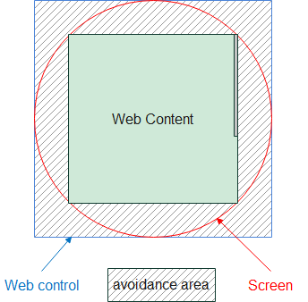

# Scrollbar Avoidance Area

## tl;dr

The proposal introduces `scrollbar-avoidance-area` as a new CSS property, enabling web developers to define an avoidance area for the scrollbar and control the scrollbar within a concrete part of the viewport. 

## Background

To provide users with a complete experience, web apps may display a webpage in full screen. On some platforms, the content may be overlapped by the status bar at the top (e.g., time, battery status, signal strength, and notifications) and the navigation bar at the bottom.   
 


In this scenario, the web content would need to avoid the system bars at the top and the bottom. 
Currently, web developers can achieve this by obtaining the system's safe area from the 'env()' CSS function and then setting a padding for the content.

```
env(safe-area-inset-top);
env(safe-area-inset-bottom);
```

However, the scrollbar cannot use the same mechanism (shown in the previous figure), resulting in an inconsistent user experience.

Devices with non-rectangular screens typically require web documents to set an avoidance area, ensuring that both the web content and the scrollbar are visible to users.


 
## Proposal

This proposal aims to introduce four new CSS properties: `scrollbar-avoidance-area-top`, `scrollbar-avoidance-area-bottom`, `scrollbar-avoidance-area-left`, and `scrollbar-avoidance-area-right`. 

These properties would enable developers to set an offset for the scrollbar area in the viewport, limiting the scrollbar to be shown and operated only within a specified portion of the viewport. 

### Example:

```html
<!--index.html-->
<!DOCTYPE html>
<html>
	<head>
        <meta name="viewport" content="width=device-width, initial-scale=1.0, viewport-fit=cover">
		<title>Demo</title>
		<style>
			body {
				width:2560px;
				height:2560px;

				padding-top: env(safe-area-inset-top);
                padding-bottom: env(safe-area-inset-bottom);
      			padding-left: env(safe-area-inset-left);
                padding-right: env(safe-area-inset-right);

                scrollbar-avoidance-area-top:env(safe-area-inset-top);
                scrollbar-avoidance-area-bottom:env(safe-area-inset-bottom);
                scrollbar-avoidance-area-left:env(safe-area-inset-left);
                scrollbar-avoidance-area-right:env(safe-area-inset-right);

				border:5px solid blueviolet
			}
		</style>
	</head>
	<body>
		<p>Testing Set avoidance area for web content and scrollbar</p>
	</body>
</html>
```

## Other activities to consider 

It is essential to note the `scrollbar-gutter` CSS property, which enables authors to reserve space for the scrollbar, preventing unwanted layout changes as the content expands while minimizing unnecessary visuals. `scrollbar-gutter` and `scrollbar-avoidance-area` serve different purposes.
